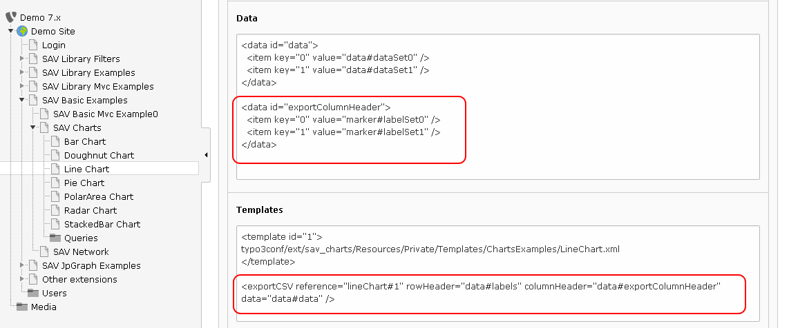
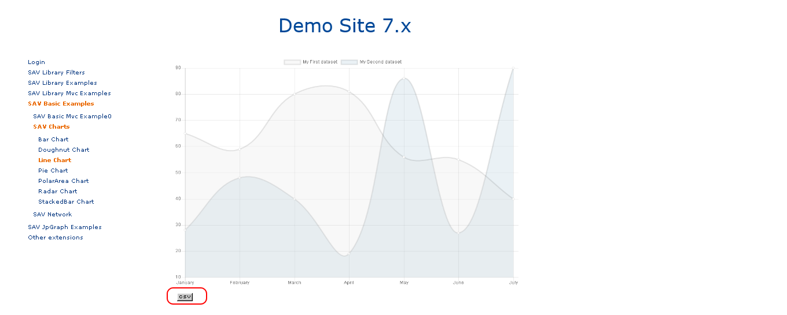

.. ==================================================
.. FOR YOUR INFORMATION
.. --------------------------------------------------
.. -*- coding: utf-8 -*- with BOM.

.. ==================================================
.. DEFINE SOME TEXTROLES
.. --------------------------------------------------
.. role::   underline
.. role::   typoscript(code)
.. role::   ts(typoscript)
   :class:  typoscript
.. role::   php(code)

Exporting data in CSV
---------------------

You can easily export data associated with any chart using the exportCSV method 
associated with the <charts> tag (see :ref:`chart.exportCsv`).

Assuming that we want to export data associated with the line chart template with 
a row header containing the x-axis labels and a column header containing the legend labels of
the two curves. Add the following code in the "Templates" section of the flexform.

Now, in the front end you should see an icon under the legend.
Click on the icon to open the CSV file.

